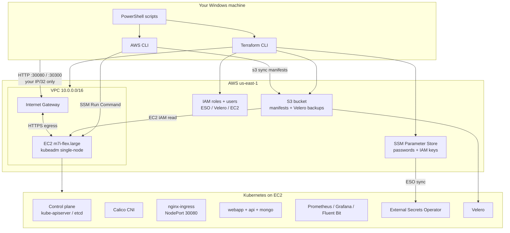
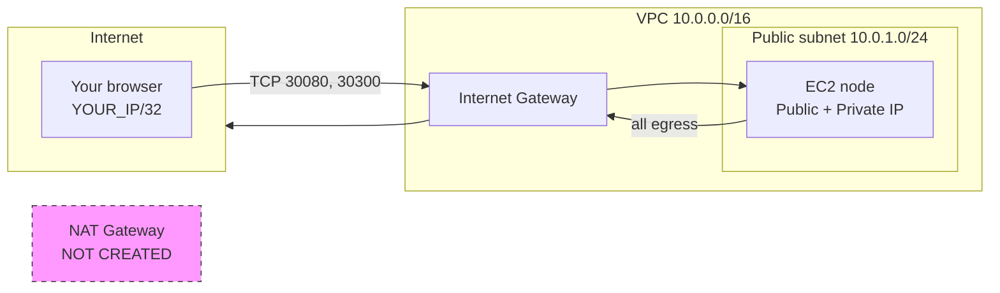
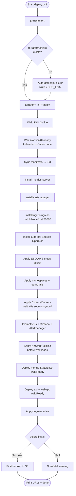
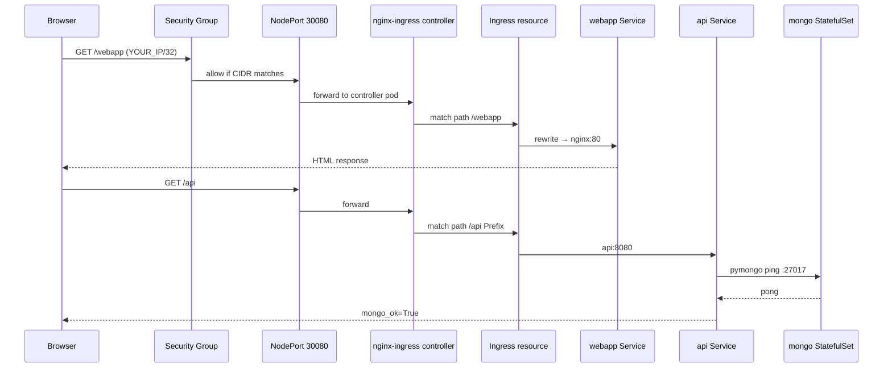
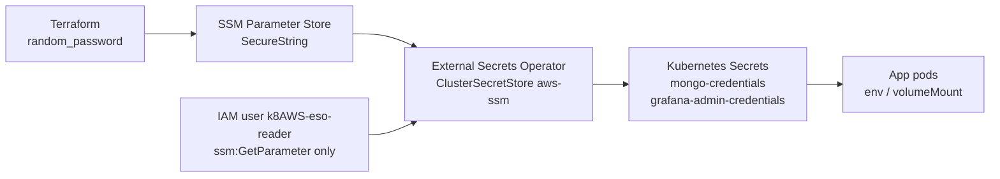

# Production-Grade Kubernetes on AWS Free Tier (2026)

**Small-org production patterns** on **1× m7i-flex.large** (8 GB RAM) in **us-east-1** — fully automated from Windows/Cursor, strict $0 guardrails (no NAT, no ALB, no SSH).

---

## What you get

| Layer | Implementation |
|---|---|
| **IaC** | Terraform: VPC, EC2, SSM secrets, S3 (Velero + manifest delivery), IAM least-privilege |
| **Bootstrap** | cloud-init: kubeadm 1.29 + containerd + Calico v3.26 + local-path storage |
| **Access** | SSM Session Manager only (port 22 closed) |
| **Secrets** | `random_password` → SSM Parameter Store → External Secrets Operator |
| **Apps** | webapp (nginx) + api (Python/pymongo) → MongoDB StatefulSet + PVC |
| **Network** | Calico NetworkPolicies (default-deny), ingress locked to **your IP/32** |
| **Reliability** | PDBs, ResourceQuota, LimitRange, Pod Security Admission (baseline) |
| **Ingress** | nginx-ingress v1.11.1 baremetal, NodePort **30080** |
| **TLS** | cert-manager + self-signed ClusterIssuer |
| **Metrics** | metrics-server (with `--kubelet-insecure-tls` for kubeadm lab) |
| **Monitoring** | Prometheus + Alertmanager + Grafana (password from SSM, anonymous disabled) |
| **Logging** | Fluent Bit DaemonSet |
| **Backup** | Velero → S3 (5 GB free tier, 30-day lifecycle) |
| **CI** | GitHub Actions: `terraform validate` + yamllint |
| **Verify** | 35 automated checks → `verify.log` |

📖 **[Complete tech stack reference →](docs/TECH-STACK.md)** — official definitions, why each tool is used, and full manual build steps.

---

## Quick local execution (3 commands)

Everything runs from your **local Windows machine** — no bastion, no SSH. Terraform creates AWS resources; PowerShell drives the rest over **SSM Run Command**.

```powershell
cd c:\dev\k8AWS
aws login
.\scripts\preflight.ps1          # validate tools + AWS creds
.\scripts\deploy.ps1             # Terraform + kubeadm + K8s apps (~25 min)
.\scripts\verify.ps1             # 35 checks → verify.log
```

When finished:

```powershell
.\scripts\destroy.ps1            # tear down ALL AWS resources
```

Non-interactive mode (no prompts):

```powershell
$env:K8AWS_AUTO_APPROVE = "true"
.\scripts\deploy.ps1
$env:K8AWS_AUTO_APPROVE = "true"
.\scripts\destroy.ps1
```

**What “local” means here:** your laptop orchestrates AWS API calls (Terraform, SSM, S3 sync). The Kubernetes control plane and workloads run on the EC2 instance in AWS — there is no local kind/minikube cluster. This mirrors how real teams operate: IaC from CI/laptop, workloads in cloud.

---

## Engineering architecture

High-level view of how your laptop, AWS, and Kubernetes connect.



---

## AWS network topology

Why **no NAT Gateway**: NAT costs ~$32+/month and is unnecessary — the node sits in a **public subnet** with a public IP. Inbound user traffic is restricted by security group to **your IP/32**; outbound (apt, container pulls, SSM) uses the IGW directly.



| Security group rule | Port | Source | Why |
|---|---|---|---|
| NodePort HTTP | 30080 | `allowed_ingress_cidr` | nginx-ingress for webapp/api |
| Grafana NodePort | 30300 | `allowed_ingress_cidr` | Grafana UI |
| HTTP | 80 | `allowed_ingress_cidr` | hostNetwork ingress fallback |
| Kubelet | 10250 | VPC CIDR | internal node health |
| K8s API | 6443 | VPC CIDR | in-VPC API access |
| SSH | 22 | — | **blocked by design** |
| Egress | all | 0.0.0.0/0 | SSM, apt, image pulls, PyPI |

Access to the node shell uses **SSM Session Manager** (outbound HTTPS to AWS endpoints) — no inbound SSH required.

---

## End-to-end deploy flowchart

What `deploy.ps1` does, in order, and why each phase exists.



**Why S3 for manifests?** SSM Run Command has a **4096-character limit** per command. Base64-encoding YAML exceeds that. The EC2 instance pulls manifests from S3 using its instance profile — same pattern as production GitOps artifact delivery.

**Why mongo before api?** The API initContainer installs `pymongo` and probes MongoDB on startup. Starting mongo first avoids crash-loop races.

**Why NetworkPolicies before apps?** Policies are applied while pods are still coming up so restarts behave correctly under default-deny rules (api→mongo ingress, api→PyPI egress on 443).

---

## HTTP request path (runtime)

How a browser request reaches your microservices.



Grafana bypasses Ingress and is exposed directly on **NodePort 30300** (defined in `prometheus-grafana.yaml`) for simpler lab access.

---

## Secrets lifecycle

Why secrets never live in Git.



| Step | Component | Why |
|---|---|---|
| Generate | `random_password` in Terraform | Cryptographically random; not in Git |
| Store | SSM Parameter Store | Encrypted at rest; audit trail; rotation-friendly |
| Sync | External Secrets Operator | Kubernetes-native; pods consume standard Secrets |
| Consume | Deployments / StatefulSets | `secretKeyRef` — same pattern as EKS + Secrets Manager |

---

## Component reference — why and how

Technical rationale for each layer. This is how a cloud/SRE team would justify the design.

### Infrastructure (Terraform)

| Resource | What it does | Why we use it |
|---|---|---|
| **VPC + public subnet** | Isolated network for the node | Required for security groups, routing, and future multi-AZ expansion |
| **Internet Gateway** | Bidirectional internet for public subnet | Node pulls container images and packages; no NAT saves ~$32/mo |
| **EC2 m7i-flex.large** | 2 vCPU, 8 GiB RAM | Free-tier eligible on 2026 accounts; minimum viable for full stack |
| **IAM instance profile** | `AmazonSSMManagedInstanceCore` + SSM read + S3 read | SSM access without SSH; ESO can read params; EC2 pulls manifests from S3 |
| **SSM parameters** | Mongo/Grafana passwords, ESO/Velero IAM keys | Central secret store; never committed to Git |
| **S3 bucket** | Velero backups + manifest staging | Durable object storage within 5 GB free tier; 30-day lifecycle |

### Bootstrap (cloud-init / user-data)

| Step | What it does | Why we use it |
|---|---|---|
| **swap off** | Disables swap | kubelet requirement — swap causes pod scheduling issues |
| **containerd** | Container runtime (CRI) | Kubernetes-native CRI; lighter than Docker CE for nodes |
| **kubeadm init** | Installs control plane + kubelet | Standard way to build conformant clusters without managed EKS cost |
| **Calico** | CNI + NetworkPolicy enforcement | Industry-standard overlay; supports `NetworkPolicy` (Flannel alone does not) |
| **local-path-provisioner** | Dynamic PV on node disk | Gives mongo a real PVC without EBS CSI complexity on free tier |
| **Taint removal** | Schedules workloads on control-plane | Single-node lab — no separate worker EC2 |

### Platform add-ons

| Component | What it does | Why we use it |
|---|---|---|
| **metrics-server** | Aggregates pod/node CPU/memory | Required for `kubectl top` and HPA |
| **nginx-ingress** | L7 routing by URL path | One entry point for webapp + api without multiple Load Balancers |
| **cert-manager** | TLS certificate automation | Production pattern; self-signed issuer for lab (swap for Let's Encrypt with real DNS) |
| **External Secrets** | Syncs SSM → K8s Secrets | Same pattern as AWS Secrets Manager + ESO on EKS |
| **Velero** | Cluster backup to S3 | Disaster recovery for app namespace; scheduled daily at 03:00 UTC |

### Application layer

| Component | What it does | Why we use it |
|---|---|---|
| **webapp (nginx)** | Static front-end + HPA | Demonstrates stateless scaling and ingress routing |
| **api (Python/pymongo)** | Health endpoint with Mongo ping | Proves service-to-service connectivity and secret injection |
| **mongo StatefulSet** | Persistent database with PVC | Stateful workloads need stable identity + storage — Deployment is wrong here |
| **NetworkPolicies** | default-deny + explicit allow | Zero-trust pod networking — api only talks to mongo on 27017, ingress only from nginx namespace |

### Observability

| Component | What it does | Why we use it |
|---|---|---|
| **Prometheus** | Scrapes pod metrics via annotations | Industry-standard metrics; feeds alerts and Grafana |
| **Alertmanager** | Routes alert notifications | Production pattern — rules defined even if notifications go nowhere in lab |
| **Grafana** | Dashboards + login | Visual confirmation cluster is healthy; password from SSM |
| **Fluent Bit** | Log collection DaemonSet | Same agent pattern used on EKS Fargate / CloudWatch pipelines |

### Guardrails

| Resource | What it does | Why we use it |
|---|---|---|
| **PodDisruptionBudget** | minAvailable: 1 | Prevents voluntary disruption from draining all replicas (meaningful when scaled) |
| **ResourceQuota** | Caps CPU/memory/pods in `app` | Prevents one namespace from exhausting single-node capacity |
| **LimitRange** | Default container requests/limits | Ensures every pod has resource bounds — required for fair scheduling |
| **PSA baseline** | Pod Security Admission on `app` ns | Blocks privileged pods; aligns with production cluster policy |

---

## Manual step-by-step (if you prefer not to use deploy.ps1)

For learning or debugging — same outcome as the automated script.

### Phase 1 — AWS infrastructure

```powershell
cd c:\dev\k8AWS\terraform
copy terraform.tfvars.example terraform.tfvars   # edit allowed_ingress_cidr to YOUR_IP/32
terraform init
terraform plan
terraform apply
terraform output
```

### Phase 2 — Wait for cluster bootstrap

```powershell
cd c:\dev\k8AWS
$ID = terraform -chdir=terraform output -raw instance_id

# Wait until SSM is Online (repeat until Online)
aws ssm describe-instance-information --filters "Key=InstanceIds,Values=$ID" --region us-east-1

# Wait until kubeadm finished
.\scripts\helpers\ssm-exec.ps1 -Command "test -f /var/lib/k8s-ready && echo READY"
```

### Phase 3 — Upload manifests and apply platform stack

```powershell
$BUCKET = terraform -chdir=terraform output -raw velero_bucket_name
aws s3 sync manifests "s3://$BUCKET/manifests/" --delete --region us-east-1

# On the instance via SSM — install add-ons (metrics-server, cert-manager, ingress, ESO)
# Full command sequence is in scripts/deploy.ps1 — run that script instead for reliability.
.\scripts\deploy.ps1
```

### Phase 4 — Verify and use

```powershell
.\scripts\verify.ps1
start "http://$(terraform -chdir=terraform output -raw public_ip):30080/webapp"
```

### Phase 5 — Destroy

```powershell
.\scripts\destroy.ps1
```

---

## Prerequisites (one-time)

Install on your Windows machine:

| Tool | Purpose | Verify |
|---|---|---|
| [AWS CLI v2](https://aws.amazon.com/cli/) | Terraform + deploy scripts | `aws --version` |
| [Terraform ≥ 1.5](https://developer.hashicorp.com/terraform/install) | Infrastructure | `terraform version` |
| PowerShell 5.1+ | Scripts | `$PSVersionTable.PSVersion` |

AWS account requirements:

- **2026 account** (or account where **m7i-flex.large** is free-tier eligible in **us-east-1**)
- IAM permissions for EC2, VPC, IAM, SSM, S3
- Free-tier credits active (~$100 for 6 months post–July 2025 model)

---

## Step-by-step: deploy the lab

### 1. Clone and open in Cursor

```powershell
cd c:\dev\k8AWS
```

### 2. Authenticate to AWS

```powershell
aws login
aws sts get-caller-identity
```

You must see your Account ID. If this fails, fix credentials before continuing.

### 3. Preflight checks

```powershell
.\scripts\preflight.ps1
```

This validates AWS credentials, tools in PATH, m7i-flex.large free-tier eligibility, and Terraform config.

### 4. Deploy (~20–35 minutes first run)

```powershell
.\scripts\deploy.ps1
```

What happens automatically:

1. Creates `terraform/terraform.tfvars` from your public IP (`checkip.amazonaws.com`) if missing
2. `terraform apply` — VPC, EC2, SSM parameters, S3 bucket, IAM
3. Waits for SSM agent + kubeadm bootstrap (`/var/lib/k8s-ready`)
4. Syncs manifests to S3 (avoids SSM 4096-char command limit)
5. Installs platform add-ons: metrics-server, cert-manager, nginx-ingress, External Secrets
6. Syncs secrets from SSM → Kubernetes via ESO
7. Deploys observability stack, **NetworkPolicies**, mongo → api → webapp, ingress
8. Optionally installs Velero + first backup

Non-interactive (CI / automation):

```powershell
$env:K8AWS_AUTO_APPROVE = "true"
.\scripts\deploy.ps1
```

When deploy finishes, note the printed URLs and instance ID.

### 5. Verify (35 checks)

```powershell
.\scripts\verify.ps1
```

Results are written to `verify.log`. All 35 checks should pass. If any fail, see [Troubleshooting](#troubleshooting).

### 6. Use the endpoints

Replace `<PUBLIC_IP>` with the IP from deploy output or:

```powershell
cd terraform
terraform output -raw public_ip
```

| Service | URL |
|---|---|
| Webapp | `http://<PUBLIC_IP>:30080/webapp` |
| API (Mongo health) | `http://<PUBLIC_IP>:30080/api` |
| Grafana | `http://<PUBLIC_IP>:30300` |

**Grafana login** (never stored in Git):

```powershell
aws ssm get-parameter --name /k8AWS/grafana-admin-password --with-decryption --region us-east-1 --query Parameter.Value --output text
```

Username: `admin`

### 7. Destroy when done (required)

```powershell
.\scripts\destroy.ps1
```

Type `destroy` when prompted. This removes EC2, VPC, S3 bucket, SSM parameters, and IAM users — stopping ~$0.096/hr compute charges.

Non-interactive destroy:

```powershell
$env:K8AWS_AUTO_APPROVE = "true"
.\scripts\destroy.ps1
```

---

## Configuration

Copy and edit if you need custom settings:

```powershell
copy terraform\terraform.tfvars.example terraform\terraform.tfvars
```

Key variables:

| Variable | Default | Notes |
|---|---|---|
| `allowed_ingress_cidr` | auto `/32` | **Must** be your public IP for security |
| `allow_public_ingress` | `false` | Set `true` only with `0.0.0.0/0` (not recommended) |
| `enable_velero_bucket` | `true` | Required for manifest S3 delivery + backups |
| `instance_type` | `m7i-flex.large` | Hard-coded guardrail — cannot change |
| `aws_region` | `us-east-1` | Hard-coded guardrail — cannot change |

If your IP changes mid-lab, update `allowed_ingress_cidr` in `terraform.tfvars` and run `terraform apply`.

---

## Architecture

```
Windows (Cursor)
    │
    ├── deploy.ps1 ──► Terraform ──► EC2 m7i-flex.large (us-east-1)
    │                      │              ├── Custom VPC + IGW (no NAT)
    │                      │              ├── SSM Parameter Store (secrets)
    │                      │              ├── S3 bucket (manifests + Velero)
    │                      │              └── cloud-init → kubeadm cluster
    │
    └── verify.ps1 ──► HTTP checks + SSM kubectl checks

Kubernetes (single node):
    ├── webapp (nginx) + HPA
    ├── api → MongoDB (NetworkPolicy enforced)
    ├── mongo StatefulSet + local-path PVC
    ├── nginx Ingress (NodePort 30080)
    ├── cert-manager (self-signed issuer)
    ├── metrics-server + Prometheus + Alertmanager + Grafana
    ├── Fluent Bit
    └── Velero → S3 daily backup (app namespace)
```

---

## Troubleshooting

### Deploy stuck on “Waiting for kubeadm bootstrap”

```powershell
.\scripts\logs.ps1
```

Bootstrap log: `/var/log/kubeadm-init.log` on the instance.

### SSM not online

Wait 2–5 minutes after EC2 launch. Then:

```powershell
aws ssm start-session --target <INSTANCE_ID> --region us-east-1
```

### ExternalSecrets not syncing

```powershell
.\scripts\helpers\ssm-exec.ps1 -Command "kubectl describe externalsecret -A"
.\scripts\helpers\ssm-exec.ps1 -Command "kubectl get clustersecretstore aws-ssm -o yaml"
```

### API returns 503 / mongo_ok=False

Usually mongo not ready or NetworkPolicy issue:

```powershell
.\scripts\helpers\ssm-exec.ps1 -Command "kubectl get pods -n app"
.\scripts\helpers\ssm-exec.ps1 -Command "kubectl logs -n app -l app=api --tail=50"
```

### HTTP checks fail from verify but pods are Running

- Confirm you are on the same public IP used in `allowed_ingress_cidr`
- Security group only allows **your IP/32** on ports 30080 and 30300

### Velero failed (non-fatal)

Deploy continues. Cluster works without Velero. Re-run Velero steps manually via SSM if needed.

---

## Cost

| Resource | Approximate cost |
|---|---|
| m7i-flex.large | ~$0.096/hr (from free-tier credits) |
| S3 Velero + manifests | Within 5 GB free tier |
| NAT Gateway | **Not created** |
| ALB | **Not created** |

**3-hour lab ≈ $0.29** — always run `destroy.ps1`.

---

## Honest reliability assessment

| Question | Answer |
|---|---|
| Will this work **100%** guaranteed? | **No** — not without a live end-to-end run on your account. Upstream URLs (Calico, ingress-nginx, ESO, apt k8s packages) can change; free-tier eligibility varies by account age. |
| Expected success rate after fixes | **~90–95%** on a fresh 2026 account with valid credits and stable internet |
| Structural limits (by design) | Single-node (no HA), `--kubelet-insecure-tls`, static IAM keys for ESO/Velero, self-signed TLS only, 8 GB RAM ceiling |
| What would improve it further | Live E2E test in CI, IRSA instead of static keys, pre-built api image (no pip at runtime), second worker node, real DNS + Let's Encrypt |

---

## Optional upgrades (when budget allows)

- Second worker EC2 + `kubeadm join`
- AWS Load Balancer Controller + ALB
- ArgoCD or Flux GitOps
- EKS managed control plane
- Amazon RDS / DocumentDB instead of in-cluster MongoDB

---

## Project layout

```
k8AWS/
├── docs/
│   └── TECH-STACK.md       # Complete stack reference — definitions, why/how, manual steps
├── terraform/              # AWS infrastructure (VPC, EC2, IAM, SSM, S3)
│   ├── vpc.tf
│   ├── ec2.tf
│   ├── secrets.tf
│   ├── ssm-parameters.tf
│   ├── velero-s3.tf
│   ├── variables.tf
│   ├── outputs.tf
│   ├── versions.tf
│   ├── terraform.tfvars.example
│   └── user-data/
│       └── kubeadm-init.sh # cloud-init bootstrap script
├── manifests/
│   ├── namespace/          # app, observability, ingress-nginx, external-secrets
│   ├── policy/             # PDB, ResourceQuota, LimitRange
│   ├── secrets/            # ExternalSecrets + ClusterSecretStore
│   ├── security/           # cert-manager ClusterIssuer
│   ├── networking/         # NetworkPolicy, Ingress, NodePort patch
│   ├── database/           # mongo StatefulSet + PVC
│   ├── microservices/      # webapp (nginx) + api (Python/pymongo)
│   ├── observability/      # Prometheus, Grafana, Alertmanager, Fluent Bit
│   └── backup/             # Velero schedule + BackupStorageLocation
├── scripts/
│   ├── preflight.ps1       # Pre-deploy validation
│   ├── deploy.ps1          # Full deploy pipeline
│   ├── verify.ps1          # 35 post-deploy checks
│   ├── destroy.ps1         # Tear down everything
│   ├── logs.ps1            # Remote bootstrap logs
│   └── helpers/
│       └── ssm-exec.ps1    # SSM Run Command wrapper
├── .github/workflows/
│   └── ci.yaml             # terraform validate + yamllint
├── .gitignore
├── LICENSE
└── README.md
```

**Deep dive:** [docs/TECH-STACK.md](docs/TECH-STACK.md) — official definitions, use cases, and phase-by-phase manual build for every component.

---

## SRE production structure review

Expert assessment of this repository layout against production SRE standards.

### What is correct (production-aligned)

| Area | Verdict | Notes |
|---|---|---|
| **Separation of concerns** | ✅ Good | `terraform/` (infra), `manifests/` (K8s), `scripts/` (orchestration) — clean boundaries |
| **No secrets in Git** | ✅ Good | `.gitignore` blocks tfvars/state; passwords in SSM only |
| **IaC for all AWS resources** | ✅ Good | Nothing requires manual console steps |
| **Destroy path exists** | ✅ Good | `destroy.ps1` + Terraform default tags `AutoDestroy=true` |
| **Remote access model** | ✅ Good | SSM-only — no SSH keys, no port 22 |
| **Network zero-trust** | ✅ Good | Calico NetworkPolicy default-deny + SG IP lockdown |
| **Resource governance** | ✅ Good | ResourceQuota, LimitRange, PDB, PSA baseline |
| **Observability triad** | ✅ Good | Metrics (Prometheus) + logs (Fluent Bit) + dashboards (Grafana) |
| **Backup strategy** | ✅ Good | Velero to S3 with lifecycle expiration |
| **Verification gate** | ✅ Good | 35-check `verify.ps1` before declaring success |
| **CI validation** | ✅ Good | Terraform fmt/validate + yamllint on every push |
| **Cost guardrails** | ✅ Good | No NAT, no ALB, instance type/region locked in Terraform |
| **Manifest delivery** | ✅ Good | S3 sync avoids SSM payload limits — production pattern |

### Known gaps (acceptable for free-tier lab, fix for real production)

| Gap | Severity | Recommendation |
|---|---|---|
| Single-node cluster | High for prod | Add worker node + remove control-plane taint |
| Local Terraform state | Medium | Add S3 backend + DynamoDB lock for team use |
| Static IAM keys for ESO/Velero | Medium | Use IRSA (EKS) or instance profile with scoped policies |
| `--kubelet-insecure-tls` | Medium | Install proper kubelet serving certs (kubeadm certs pattern) |
| No GitOps controller | Low | Add ArgoCD/Flux — currently script-driven apply |
| api pip install at runtime | Low | Build custom container image with pymongo pre-baked |
| `metrics-server.yaml` / `storage-class.yaml` | Low | Placeholder/reference only — not applied directly (documented) |
| No live E2E in CI | Medium | Add OIDC-based deploy smoke test on dedicated AWS account |
| Self-signed TLS only | Low | Add Route53 + Let's Encrypt ClusterIssuer when domain available |
| 8 GiB RAM ceiling | High at scale | Full observability stack + apps may OOM under load testing |

### Overall SRE score

| Lens | Score | Summary |
|---|---|---|
| Free-tier lab / learning | **9/10** | Complete, automated, destroyable |
| Small-org single-node patterns | **8.5/10** | Real production patterns at minimal scale |
| Multi-node HA production | **4/10** | By design — one instance |
| Enterprise compliance | **6/10** | Good foundations; static keys and single node limit audit score |

**Verdict:** Folder structure and component choices are **correct and production-pattern-aligned** for a single-node AWS lab. The layout would scale to a multi-node/EKS migration by moving `manifests/` into GitOps and replacing kubeadm bootstrap with managed node groups — without restructuring the repo.

---

## CI

On push/PR: `terraform validate` and yamllint on manifests. Does not deploy to AWS (no credentials in CI by default).

---

## Start now (immediate steps)

```powershell
cd c:\dev\k8AWS
aws login
.\scripts\preflight.ps1
.\scripts\deploy.ps1
.\scripts\verify.ps1
# Browser: http://<PUBLIC_IP>:30080/webapp
.\scripts\destroy.ps1   # when finished
```

Full technical reference: **[docs/TECH-STACK.md](docs/TECH-STACK.md)**
